# Photobook-portfolio

A portfolio, which looks like a photobook. iCloud shared galleries only, so you can run this on any small device.

A small, fast photo portfolio that looks like a photo book: paper pages on a desk, a cover as the landing page, and every album opening like a chapter.
It has an admin panel, and photos come from **iCloud Shared Albums** and/or direct uploads.
Visitors can browse, search by tag to find their own car, view at original size, run a fullscreen slideshow, like photos, and download one photo, a whole album, or just the photos of one car.

- Node 22 · Express · SQLite (built in) · sharp. Five dependencies, no build step, no framework.
- Light pages: the styles and scripts total ≈ 50 KB (≈ 15 KB gzipped); an album page adds about 1 KB of HTML per photo (≈ 65 bytes once compressed: a 226-photo album is ≈ 15 KB over the wire). Photos load lazily.
- Runs comfortably on 1 CPU / 1 GB RAM (photo processing is one-at-a-time; peak memory stayed under 180 MB while importing a 226-photo album).

## What it looks like

All screenshots in this README use generated demo images, a placeholder name and made-up numbers, not real photos or statistics.

### The book

The landing page is a closed photobook that fills the screen. It breathes, lifts when you hover and opens only when you click it, revealing your highlight photos.
Below it, the contents page lists the albums, with search and category chips.

| Closed (click to open) | Open |
| --- | --- |
| 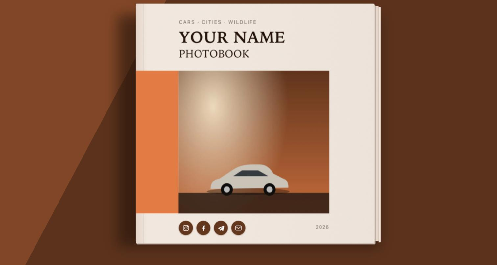 | 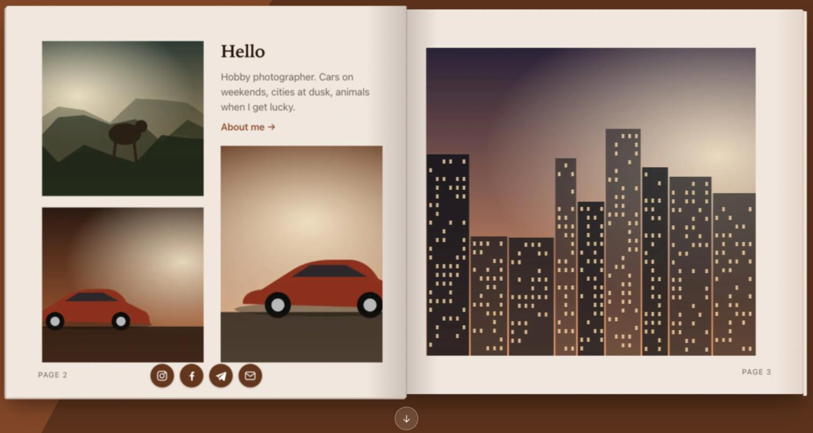 |

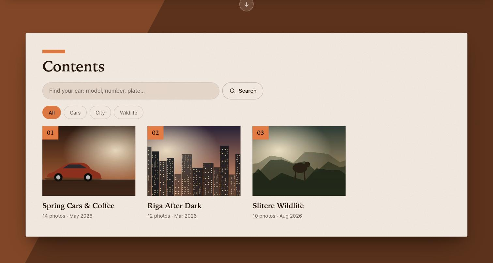

### Albums, tags and the viewer

Each album opens like a chapter, followed by a justified photo grid. Tag chips (and the search box) narrow the grid so people can find their own car; the filtered view can be shared or downloaded as a zip.

| Album opener | Photo grid |
| --- | --- |
| 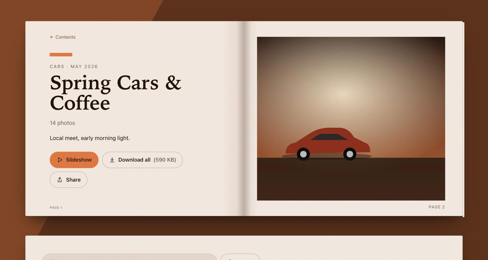 | 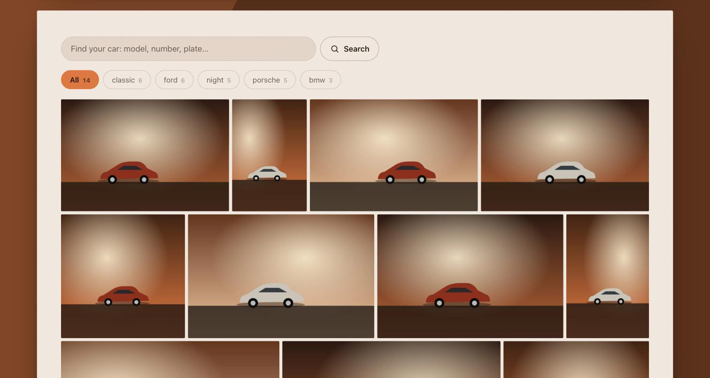 |
| **Filtered by a tag** | **Fullscreen viewer** |
| 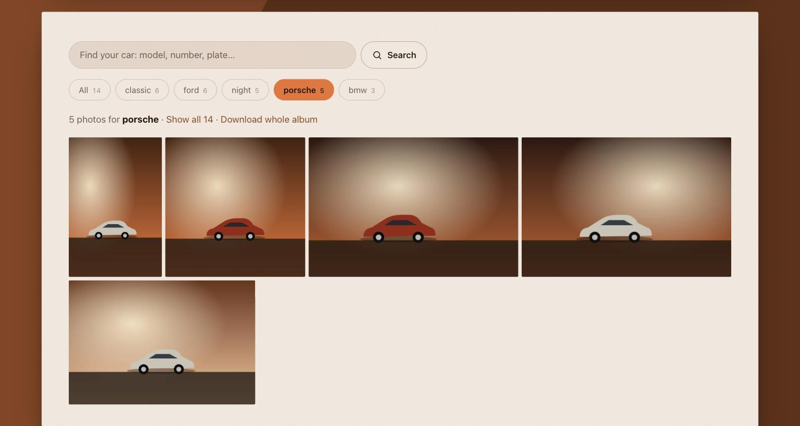 | 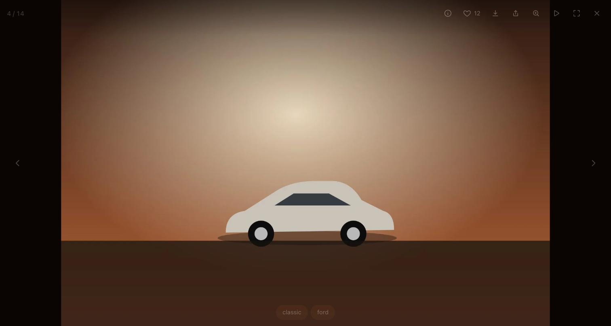 |

### On a phone

Portrait screens show the book one page at a time: tap the cover to open it, then swipe or tap the folded corner to turn the page. Landscape phones and tablets get the two-page spread.

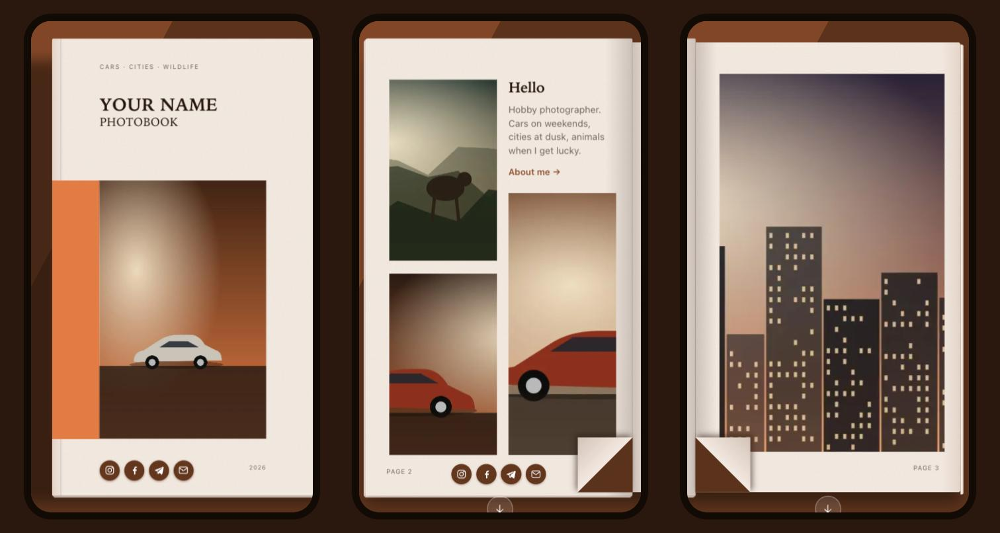

## Admin panel

The admin is a small single-page app at `/admin`: what visitors are doing, albums and photos, the title page, tags and the colour palette.

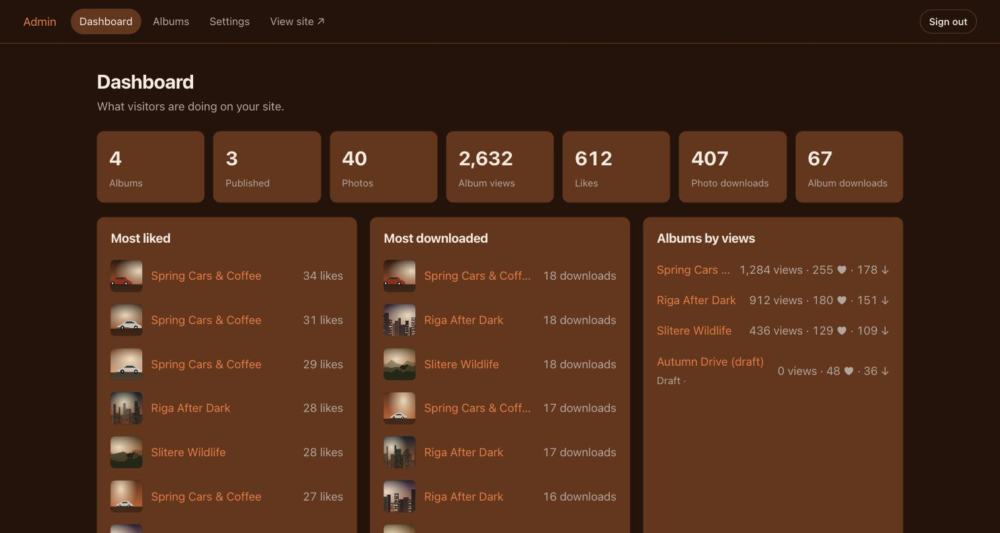

| Albums | Album details |
| --- | --- |
| 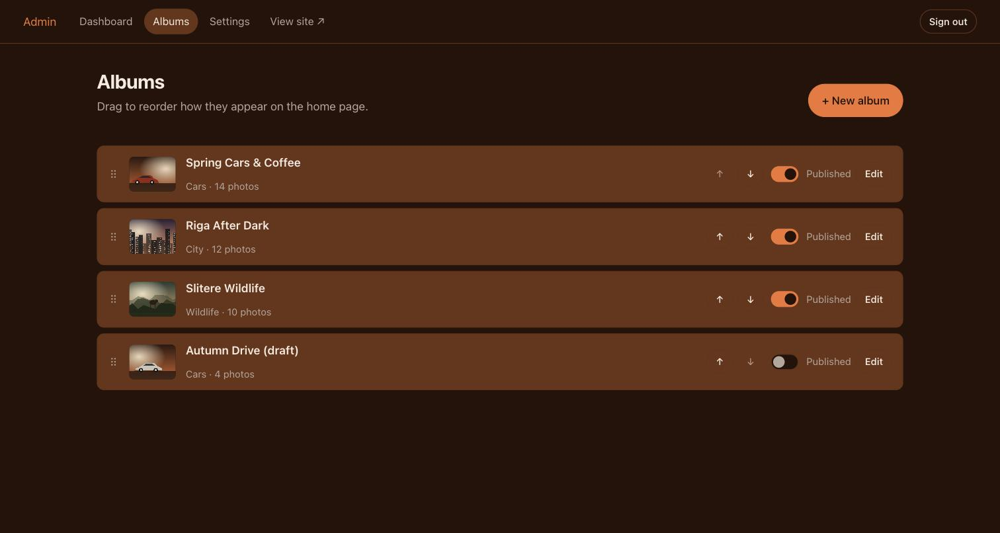 | 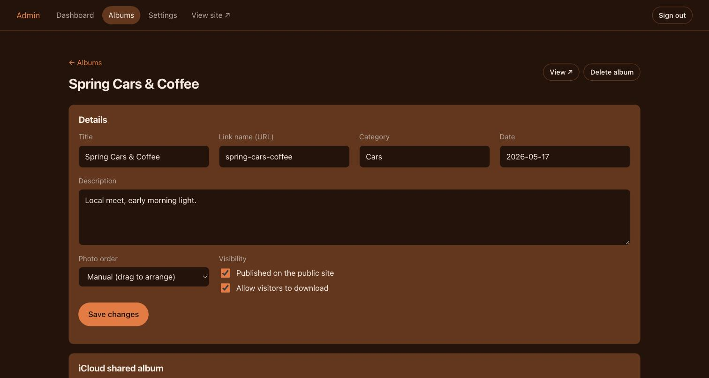 |
| **Photos and tags** | **Title page highlights** |
| 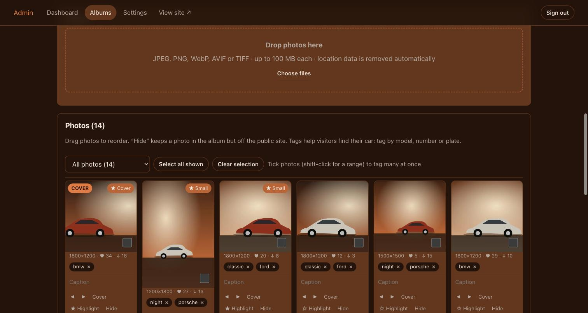 | 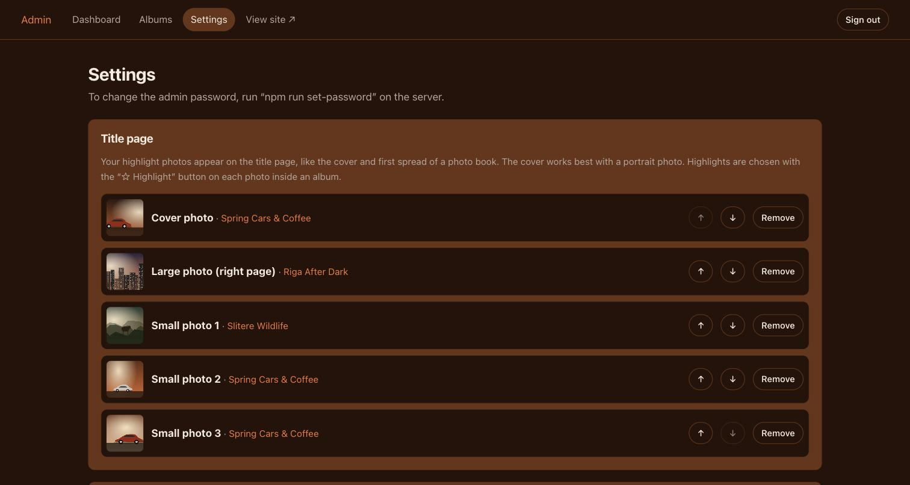 |

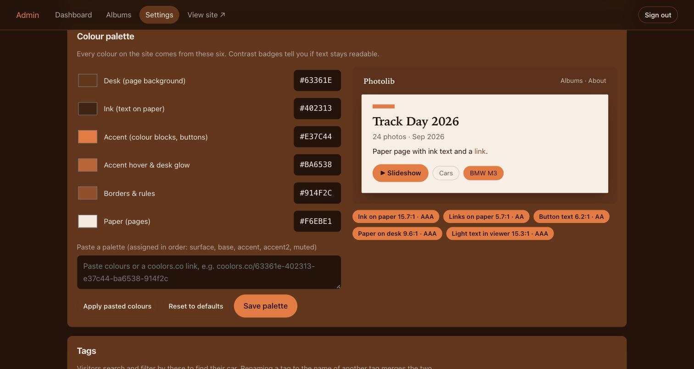

## Quick start

```bash
npm install
npm run set-password        # choose the admin password (min. 10 characters)
npm start                   # http://localhost:3000   · admin at /admin
```

## Adding photos

**From iCloud (recommended).** In the Photos app open your shared album → *People* → turn on **Public Website** → copy the link.
In the admin: *Albums → New album → paste the link → Save & sync now*. New photos are picked up automatically
(default every 6 hours, change it in *Settings*). Photos you remove from the iCloud album disappear here too.
Your captions, hidden flags and ordering are kept across syncs.

> iCloud only shares photos at roughly 2048–2300 px on the long edge, and the site can only show what iCloud provides.
> For full resolution, upload the originals in the album editor instead (each album can mix both).

**By upload.** Drag files onto the album editor (JPEG, PNG, WebP, AVIF, TIFF; up to 100 MB each).
HEIC is not supported — export as JPEG first. GPS location is removed from JPEGs on import (switch off in *Settings*).

## The title page (your highlights)

The home page is the book's cover: a closed cover on the left and an open spread of your best photos on the right, followed by the Contents (one chapter per album).
You choose what appears there:

1. Open any album in the admin and press **☆ Highlight** on up to five photos.
2. In *Settings → Title page* put them in order: **1 = cover photo** (portrait photos suit it best), **2 = the large right-hand page**, **3–5 = the small photos** on the left page.
3. Set the cover wording in *Settings → Site*: site title (big cover title), tagline (small line above it), cover subtitle (e.g. “Portfolio”), the heading for the intro text,
   and your *About* text, whose first paragraph is the intro on the spread (see below).

On a desktop screen the title page is a full-screen book that stays **closed until you click it**. The cover slowly lifts, a glint of light crosses it,
and it rises further when the pointer is over it, hinting at the first page underneath. After about three seconds a small **“Open the book”** pill fades in on the cover.
Clicking swings it open and the photos settle onto the pages; a labelled **“Albums”** button below the open book scrolls down to the contents
(keyboard users get the same “Open the book” button; visitors who prefer reduced motion get the same book, but it opens and turns without any movement).
**On phones held upright** (and portrait tablets) the book is shown one page at a time: tap the closed cover to open it, then swipe sideways, or tap the folded page corner, to turn to the next page.
Phones held sideways and tablets in landscape get the same two-page spread as a desktop. If the script can't run, the pages are simply stacked.
With fewer than two highlights the page shows just the cover; with none it uses your first album's cover photo.

## The About text

*Admin → Settings → Site → About text* has formatting buttons (bold, italic, heading, bulleted list, numbered list, link) and two live previews: **what the title page shows** and **what the About page shows**.
You can also type the marks yourself: `**bold**`, `*italic*`, `## heading`, `- bullet`, `1. numbered`, `[text](https://link)`; a blank line starts a new paragraph. Anything else is shown as plain text.

The intro on the title page is the **first paragraph, as plain text, cut at 256 characters** (back to a whole word, with “…”). A counter under the box shows how many characters you have,
and the part that will be cut off is shown grey and struck through. The About page always shows the whole text.

## Social links

*Admin → Settings → Site* has fields for Instagram, Facebook, TikTok, YouTube, X and Telegram (a handle such as `@yourname` or a full link), and your contact email.
Whatever is filled in appears as small icon-only links, with no visible text, on the **cover** (bottom left), on the **left page of the open book** (bottom right margin), and on the **About page**;
the email shows as a mail icon. Only plain handles and `http(s)` links are accepted.

## Tags: helping people find their car

Tag photos with whatever people would search for: the model (`BMW M3`), the number (`#42`), a plate, the driver, a colour.

- **Tagging in the admin:** open an album, tick the photos (shift-click selects a range), type tags separated by commas, press Enter.
  Use the *Untagged* filter above the grid to work through what's left. Each photo shows its tags as chips; click `×` to remove one.
- **What visitors get:** a search box and tag chips on every album page, and a site-wide search at `/search` (also on the home page).
  Matching ignores case and accents (`riga` finds `Rīga`) and works with Cyrillic. Each word of a search must match the start of a word in a tag or the caption, so `bm` finds `BMW M3` and `blue m3` needs both.
- **Shareable results:** filtered pages have real links, e.g. `/a/track-day?tag=bmw-m3`, with a link preview. The *Share this view* button shares that exact page,
  so you can send an owner a link to just their car. *Download these N* gives them a zip of only those photos.
- **Housekeeping:** *Settings → Tags* lists every tag with how many photos use it. Rename a tag to the name of another one to merge them.
  Tags only on hidden photos or unpublished albums are never shown publicly. Max 12 tags per photo, 40 characters each.

## Changing the colours

*Admin → Settings → Colour palette*: six colour pickers with a live preview and contrast warnings. Each colour has a job in the book:
**Desk** (the background the book lies on), **Ink** (text on the pages), **Paper** (the pages), **Accent** (colour blocks and buttons), **Accent hover** (also the warm glow on the desk) and **Borders**.
Paste a palette (even a `coolors.co/…` link) and it fills the first five roles in that order: desk, ink, accent, accent hover, borders.
*Reset to defaults* restores the original palette. Defaults live in one place, `DEFAULT_THEME` in [`src/theme.js`](src/theme.js);
all CSS uses only the variables generated from it, so nothing else needs touching.

## Viewer shortcuts

`←` `→` navigate · `Esc` close / stop slideshow · `Space` start / pause slideshow · `F` fullscreen · `I` info · `L` like · `Z` or double-click/tap original size ·
scroll wheel / pinch to zoom · swipe down to close. Every photo has its own link (`/a/<album>/p/<id>`) with a proper link preview.
On phones the download button opens the share sheet so people can *Save Image* straight to Photos.

## Configuration (environment variables)

| Variable | Default | |
|---|---|---|
| `PORT` / `HOST` | `3000` / `0.0.0.0` | Use `HOST=127.0.0.1` behind a proxy |
| `DATA_DIR` | `./data` | Database, originals, derived images |
| `PUBLIC_URL` | *(from request)* | Public origin, used in link previews |
| `TRUST_PROXY` | `loopback` | Express `trust proxy` value, needed for correct IPs / `Secure` cookies behind a proxy |

## Putting it on the internet

The app speaks plain HTTP on localhost, so something sits in front of it for HTTPS and compression.

**How ugis.id.lv is set up on this server**
- The app lives in `/mnt/Extra20/photos` and runs as the `photos` systemd service (`deploy/photos.service`, user `www-data`, listening on `127.0.0.1:3000`).
  Photos and the database live in `/mnt/Extra20/photos/data`.
- nginx (`deploy/nginx-ugis.id.lv.conf`, installed as `/etc/nginx/sites-available/portfolio`) terminates HTTPS with the Let's Encrypt certificate, compresses text, and proxies to the app.
  Certificate renewals are answered from `/var/www/letsencrypt`. The previous Laravel config is kept as `portfolio.bak-2026-10-06-pre-photos` in the same folder.
- Admin: https://ugis.id.lv/admin

**Common tasks**
```bash
sudo systemctl restart photos          # after changing code or settings in the unit file
sudo systemctl status photos           # is it running?
sudo journalctl -u photos -n 50        # recent log
npm run set-password                   # run in /mnt/Extra20/photos; takes effect immediately
sudo nginx -t && sudo systemctl reload nginx   # after editing the nginx file
```
After changing files under `src/` or `public/`, restart the service. Everything else (photos, albums, tags, colours) is edited in the admin and needs no restart.

**Elsewhere:** `cloudflared tunnel --url http://localhost:3000` (no port forwarding), [`deploy/Caddyfile.example`](deploy/Caddyfile.example) (automatic HTTPS), or `docker compose up -d`.

## Back up `data/`

Photos you upload exist **only** in `data/originals`, and everything else (albums, likes, captions, settings) is in `data/photolib.db`.
For a consistent copy while the site is running:

```bash
sqlite3 data/photolib.db ".backup 'data/backup.db'"   # then copy data/ elsewhere
```

## Notes & limits

- iCloud import uses Apple's unofficial public-website interface. If Apple changes it, only `src/icloud.js` is affected; uploads keep working,
  and the album editor shows the error. Videos in shared albums are skipped.
- Likes are anonymous (one per browser, via a cookie), so they can be gamed by clearing cookies. Fine for a portfolio, not a poll.
- Album zip downloads (including filtered ones) are limited to 5 per hour per visitor and 2 at a time.
- Forgot the password? Run `npm run set-password` again.

## Tests

```bash
npm test      # 47 tests: auth, GPS stripping, theme, tags & search, highlights & book pages, iCloud sync (stubbed Apple), full API flow
```
